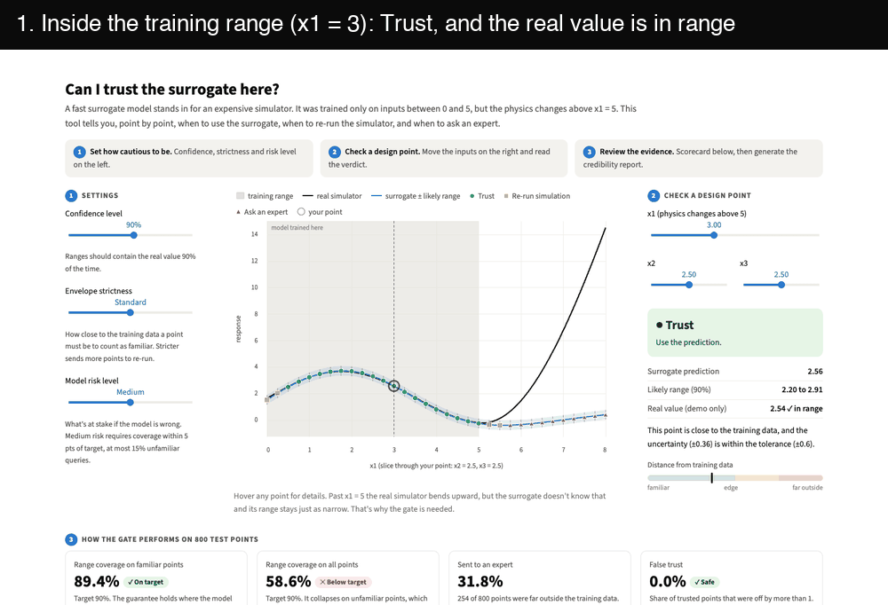
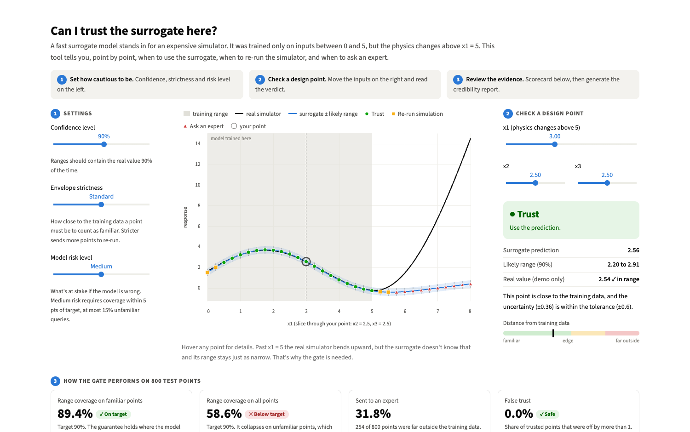
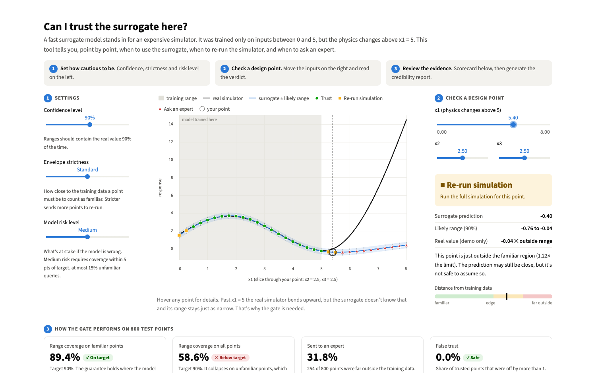
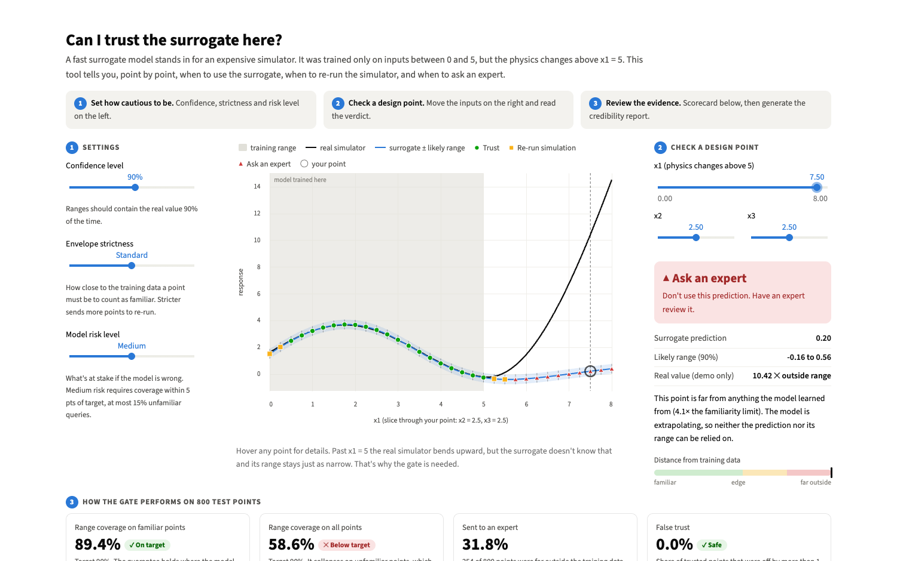
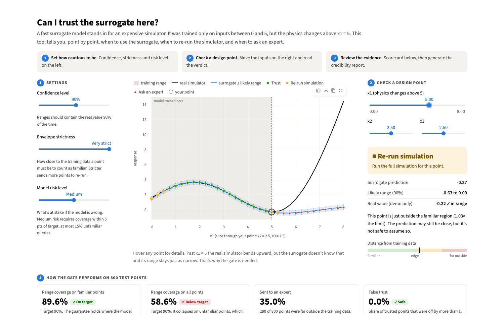
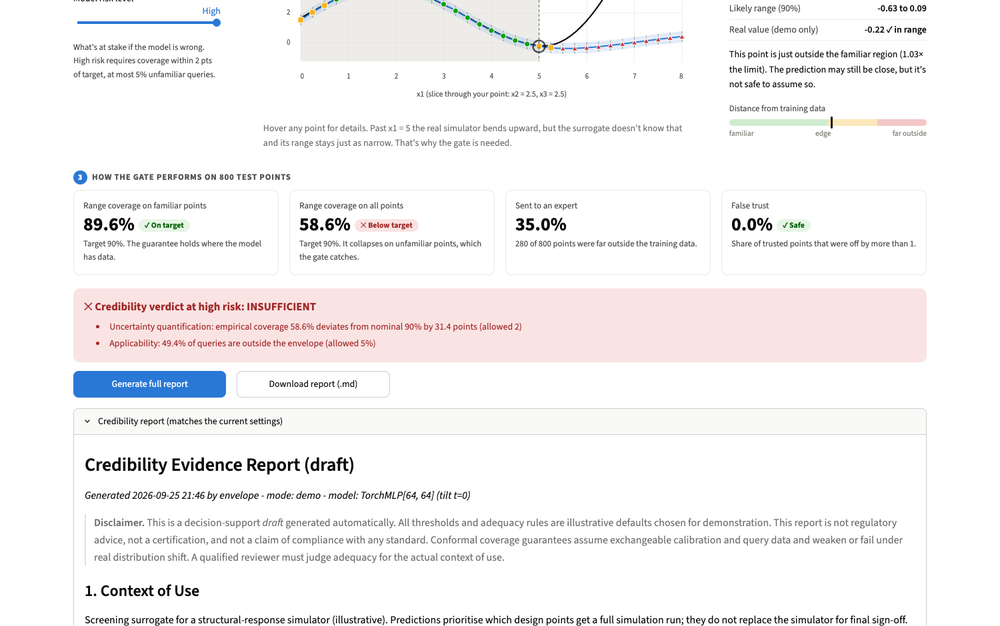

# envelope

Check whether to use a model's prediction, re-run a simulation, or ask an expert.

**Envelope** checks how familiar an input is and adds a calibrated uncertainty range
to its prediction. Use the website with synthetic sample data or your own CSVs,
then download the decisions and a credibility report. An API supports checks from
your own applications. Simulation re-runs and expert reviews are recommendations;
the product does not execute or assign them.

**Start here:** [Install and launch](#setup) · [Try the sample assessment](#try-the-product-without-your-own-data)
· [Run the simulation demo](#run-the-simulation-demo) · [Use your own model](#assess-your-model-what-a-company-does)
· [API](#api) · [Troubleshooting](#troubleshooting)

Given a surrogate (or just its predictions), `envelope`:

1. wraps predictions in **split-conformal intervals**: plain, locally adaptive, and (for white-box torch MLPs) **fragility-normalised**;
2. computes a **kNN applicability domain** (the "envelope") and scores each query against it;
3. **gates** each query: `TRUST`, `RERUN_FULL_SIMULATION` or `ESCALATE_TO_HUMAN`;
4. reports **coverage** overall, inside and outside the envelope, flag precision and recall, **tilted, tail and worst-region risk**;
5. drafts a Markdown **credibility report** with an adequacy verdict under illustrative, configurable rules.

Conformal prediction, the envelope, weight-perturbation fragility and tilted ERM are all implemented from scratch (numpy / scikit-learn / torch; no conformal libraries).

## Setup

Use **Python 3.12** (the tested version), Git, and a terminal. No API key, account,
or external simulator is needed to run the synthetic demo.

Clone the public repository:

```bash
git clone https://github.com/allegrraa/envelope.git
cd envelope
```

On **macOS / Linux**, create and activate an environment:

```bash
python3.12 -m venv .venv
source .venv/bin/activate
```

On **Windows PowerShell**, use:

```powershell
py -3.12 -m venv .venv
.\.venv\Scripts\Activate.ps1
```

Then install the dependencies and launch the website from the repository folder:

```bash
python -m pip install -r requirements.txt
python -m streamlit run app.py
```

Open **http://localhost:8501**. Leave the terminal running while you use the app;
press **Ctrl+C** to stop it. The first visit to a demo page can take longer because
the synthetic model is trained and cached if no matching saved model exists.

## Try the product without your own data

1. Open **Assess your model** in the top navigation.
2. Select **Use sample data**. The app supplies training inputs, held-out calibration
   examples, and predictions to check from its synthetic simulator.
3. Keep the default columns and settings for your first run, then click **Run assessment**.
4. Review **Decisions** for each prediction's range and recommendation, **Coverage**
   for measured performance, and **Data checks** for input problems.
5. Open **Report & export** to download the report, decisions CSV, or API state.

“Queries” means **new cases you want assessed**: each row has input values and a
model prediction. The true outcome is optional; supplying it allows the app to
measure actual prediction errors and interval coverage.

To explore a single case, open **Interactive example**. Start with `x1 = 3`, then
move it toward `8` while keeping `x2 = x3 = 2.5`. Watch the model prediction diverge
from the real simulator response and read the recommendation. Open **Guided tour**
for the five-stage walkthrough suitable for a short demo video.

An **INSUFFICIENT** report is a valid result: it identifies evidence gaps under the
selected risk rules. Some individual predictions may still qualify for **Trust**.
All built-in sample data is synthetic; it does not establish real-world performance.

## Run the simulation demo

This runs a complete local experiment: generate synthetic data, train a surrogate,
calibrate its uncertainty, assess predictions, and produce plots and reports.
The simulator is a mathematical function in `envelope/data.py`; it does not require
commercial simulation software. It changes behaviour beyond `x1 = 5`, outside the
model's training region, to demonstrate extrapolation failure.

In an activated environment, from the repository folder:

```bash
python run_demo.py
```

Optional variants (choose one):

```bash
python run_demo.py --risk high          # apply the stricter report rules
python run_demo.py --fast               # fewer training epochs; results will differ
```

Runtime depends on your machine. When it finishes, inspect:

| Output | How to use it |
|---|---|
| `out/report.md` | Read the credibility report and evidence gaps. |
| `out/queries.csv` | Inspect predictions, intervals, scores, and decisions. |
| `out/slice.png` | Compare the surrogate with the true simulator. |
| `out/upload_example/` | Try the generated CSVs in **Assess your model → Upload my files**. |
| `out/state.npz` | Start the API with the demo's calibration state. |
| `out/demo_script.md` and `out/frames/` | Use the generated narration and frames for a recording. |

Generated files in `out/` and the local virtual environment are excluded from Git.
Run `python run_demo.py` after cloning to recreate the demo reports, example CSVs,
saved model, and API state. The website can also generate its synthetic model on first use.

Run the automated checks with `python -m pytest -q`.

## The website

`streamlit run app.py` serves a website with a top navigation bar. After changing code, restart the server: Streamlit does not reload helper modules such as `ui_common.py` while it runs.

| Page | URL | For |
|---|---|---|
| Home | `/` | What envelope does, how it works, what it does not claim |
| **Assess your model** | `/assess` | Companies upload their own model's outputs and get results |
| Interactive example | `/example` | Explore the synthetic example: settings, point checker, scorecard |
| Guided tour | `/tour` | The five-stage walkthrough, also used for screen recordings |
| API | `/api` | How to call envelope from your own systems |

### Assess your model: what a company does

1. **Upload three CSVs.** No model upload is needed. Use numeric inputs and one numeric output. Templates are under "What files do I need?".
   - Training inputs.
   - A held-out calibration set with true values and predictions.
   - The queries to assess: new cases with input values, model predictions, and optional true outcomes. Each row is one case, not a chat prompt or database query.
2. **Check the columns.** Inputs, true value and prediction are detected from common names such as `actual`, `measured`, `prediction` or `model_output`, and every choice can be changed.
3. **Choose settings.**
   - Confidence level.
   - Envelope strictness.
   - Model risk level.
   - Acceptable error, in your target's units. The default is 1.25× the selected-confidence quantile of absolute calibration errors; set it to what your application tolerates.
   - Model name and context of use.
4. **Run the assessment.** You get:
   - the adequacy verdict with concrete gaps;
   - the share of predictions to trust, re-run or escalate;
   - coverage: measured with exact intervals if the queries have true values, otherwise estimated and labelled as such;
   - the guarantee-validity check;
   - tabs for **Decisions** (filterable, with a reason per row), **Coverage** (including by bin), **Envelope**, and **Data checks**.
5. **Export** the credibility report (`.md`), the decisions (`.csv`), and an **API state** file (`.npz`) for checking new predictions from your own systems.

Keep the same feature columns and units across all three files, and use the same
model to produce calibration and query predictions. Calibration examples must be
held out from model training. With the default neighbour setting, you need more
than 5 complete training rows; the website requires at least 20 complete calibration
rows. These are minimum input requirements, not a recommendation for sufficient
statistical evidence. Include at least one complete query row.

**Model risk level** selects the report's acceptance rules. **Acceptable error**
sets the maximum interval half-width for Trust, and **Envelope strictness** changes
the input-familiarity boundary. Coverage assumptions still matter: an input being
inside the envelope does not certify that its prediction is correct.

Assessments are held in memory for the session. Creating the API-state download briefly writes training and calibration arrays to a temporary directory, which is removed afterwards. Downloads retain the data they contain. There is no database or authentication; public multi-tenant deployment is out of scope.

## Guided tour (Demo Mode)

The **Guided tour** page (`/tour`) is a scripted, five-stage walkthrough built for a 60-second screen recording. It uses a wide layout, large fonts and a light high-contrast theme, and every stage is labelled "Synthetic demo data".

1. **Model looks perfect.** True function, training range [0, 5], and the surrogate inside it.
2. **The failure.** Extends to [0, 8]. The surrogate is confident, but wrong outside its training range.
3. **Envelope on.** Conformal error bars, points coloured by gate decision, and a count for each decision.
4. **Scoreboard.** "Trust everything" vs "With Envelope": the share of out-of-range answers that were off by more than `error_tolerance` and trusted anyway. Below that, target vs actual coverage inside and outside the envelope, with Clopper-Pearson intervals.
5. **Report.** "Generate report" shows the verdict for the selected risk level (default high), the top gaps, and a Markdown download. This screen also states the guarantee's limits.

Navigation:
- **Next →** or the **Right Arrow** key moves forward; **Reset** returns to stage 1.
- The progress bar shows where you are.
- Each caption is generated from the computed numbers.

`envelope/demo_story.py` computes every number on screen from one pipeline run, with a fixed seed and the unmodified `config.yaml`. Nothing is hard-coded, and no parameter was tuned after seeing results. **The simulator design is fixed in advance:** a stiffening term `0.9 * max(0, x1 - 5)^2 * (1 + 0.15 x2)` switches on only above x1 = 5, and the surrogate trains only on [0, 5]^3 (see `envelope/data.py`). The tests check this design produces a regime change, not that the results look good.

### How to record the demo

1. Run `python run_demo.py`. It trains and saves the surrogate (`out/surrogate_mlp.pt`, so the app opens without training) and writes:
   - `out/demo_numbers.json`: every number shown on screen;
   - `out/demo_script.md`: the six-part narration with real numbers and timing marks;
   - `out/frames/stage1-5.png`: static fallback frames.
2. Run `streamlit run app.py` and open http://localhost:8501/tour. Let it load once (the first load takes a few seconds), then press **Reset**.
3. Make the browser full screen (1600×900 or larger). Zoom to 100–110%. Keep the sidebar collapsed.
4. Start the screen recorder. Read `out/demo_script.md` aloud, pressing **Right Arrow** at each timing mark:

   | Time | Stage |
   |---|---|
   | 0–8 s | 1 |
   | 8–20 s | 2 |
   | 20–35 s | 3 |
   | 35–47 s | 4 |
   | 47–56 s | 5; click **Generate report** |
   | 56–60 s | hold on the final screen |

5. If the live app misbehaves, cut the video from `out/frames/`. The frames show the same numbers.
6. After changing code or config, re-run `run_demo.py` before recording, so the script matches the screen. `tests/test_demo_mode.py` checks the numbers are deterministic and the script has no unfilled placeholders.

## Explore mode: how to use it

Open **Interactive example** in the top navigation (http://localhost:8501/example).



The screen answers one question: **can I trust the surrogate's prediction at this point?** A user works through it in three steps.

**1. Set how cautious to be (left).**
- **Confidence level:** how often the likely range should contain the real value.
- **Envelope strictness:** how close to the training data a point must be to count as familiar. Loose to Very strict maps to the 99th to 85th percentile threshold.
- **Model risk level:** which adequacy rules the report applies.

Each setting explains its effect in words underneath.

**2. Check a design point (right).** Move x1, x2 and x3. The panel shows:
- a verdict with the action to take: **● Trust** (use it), **■ Re-run simulation**, or **▲ Ask an expert**;
- the prediction and its likely range;
- the real simulator value (known in this demo) and whether it fell inside the range;
- a plain-language reason;
- a bar showing how far the point is from the training data.

The chart in the middle is a slice through your point. It shows the real simulator, the surrogate with its range, and gate decisions coloured by shape and colour. Hover any point for details.

| Step | What you see |
|---|---|
|  | **x1 = 3, inside the training range.** Trust. The range 2.20 to 2.91 contains the real value 2.54. |
|  | **x1 = 5.4, just past the edge.** Re-run simulation. The real value already sits just outside the range. |
|  | **x1 = 7.5, far outside.** Ask an expert. The surrogate says 0.20 with a narrow range, but the real value is 10.42. |
|  | **Very strict envelope.** Even x1 = 5.0 is sent to re-run, and the share sent to an expert rises. |
|  | **High risk.** The verdict banner lists the gaps. Generate or download the full credibility report. |

**3. Review the evidence (bottom).** Scorecard cards cover 800 test points:
- range coverage on familiar points vs the target;
- range coverage on all points, which collapses outside the training range;
- the share sent to an expert;
- **false trust:** trusted points that were off by more than `error_tolerance`.

Below the scorecard, a verdict banner lists what is missing for the chosen risk level. **Generate full report** opens the Markdown report, and **Download report** saves it.

The model is trained once and cached. Settings rerun the assessment and are cached per setting.
Upload mode is available on **Assess your model**. Fragility and tilt-training experiments
are available from Python (`envelope.pipeline.run_pipeline`, `run_demo`, `tilt_comparison`)
and `run_demo.py`.

## Troubleshooting

| Problem | What to do |
|---|---|
| A package or `streamlit` cannot be found | Activate `.venv`, install `requirements.txt`, and use `python -m streamlit run app.py`. |
| The browser does not open automatically | Open `http://localhost:8501` yourself while the server is running. |
| Port 8501 is already in use | Run `python -m streamlit run app.py --server.port 8502` and open `http://localhost:8502`. |
| First demo load is slow | Allow the synthetic model to train, or prepare it with `python run_demo.py` before starting the website. |
| The API returns 503 because its state is missing | Run `python run_demo.py`, or point `ENVELOPE_STATE` at a state downloaded from an assessment. |
| The API's `/report` returns 404 for a downloaded state | The website exports its report separately; its state file does not bundle a report path. |
| CSV columns are rejected | Use numeric features, distinct actual/prediction columns, and matching feature and prediction names across the required files. |
| Changed settings do not match the displayed assessment | Click **Run assessment** again. |
| Styles or helper-code changes do not appear | Stop Streamlit with Ctrl+C and restart it. |

## API

`run_demo.py` saves the calibrated state to `out/state.npz`: the calibration set, training features for the envelope, the envelope threshold, gate cutoffs, alpha and the report path. It is stored as plain arrays plus JSON, with no pickles. On load the API refits the envelope deterministically and checks the threshold against the saved value. Use a different file with `ENVELOPE_STATE=/path/state.npz`.

| Endpoint | Returns |
|---|---|
| `GET /health` | Status, features, method, alpha, envelope threshold, gate cutoffs. 503 if no state file. |
| `POST /assess` | Assessment of one prediction (below) |
| `GET /report` | The latest credibility report (`text/markdown`), read from disk on each request |

Start the API in one terminal (after generating `out/state.npz`):

```bash
python -m uvicorn envelope.api:app --port 8000
```

In a **second terminal**, try these requests. The predictions below are illustrative;
in your integration, send the output of the same model used during calibration.

```bash
curl -s localhost:8000/health

curl -s -X POST localhost:8000/assess \
  -H 'Content-Type: application/json' \
  -d '{"features": [2.5, 2.5, 2.5], "y_pred": 3.2}'
# {"y_pred":3.2,"interval_low":2.842,"interval_high":3.558,"in_envelope":true,"envelope_score":0.73,
#  "decision":"TRUST","reason":"Inside the validity envelope (score 0.73 <= 1) and interval half-width 0.358 <= tolerance 0.6.",
#  "alpha":0.1,"assumptions":"Split conformal at alpha=0.1: ... only on average over queries exchangeable with the calibration data ..."}

curl -s -X POST localhost:8000/assess -H 'Content-Type: application/json' \
  -d '{"features": [7.5, 2.5, 2.5], "y_pred": 0.3}'     # -> ESCALATE_TO_HUMAN (envelope score about 4.1)

curl -s localhost:8000/report
```

`features` must be in training column order (`x1, x2, x3` for the demo). A wrong length or non-finite values return 422. `y_pred` must come from the same model whose calibration predictions are in the state file. The API receives only predictions, never model weights. If the saved method is `fragility`, the API therefore uses split conformal and says so in `/health`. Interactive docs are at `http://localhost:8000/docs`.

`./out/` contains:

| File | What it shows |
|---|---|
| `slice.png` | Simulator vs surrogate with intervals and gate decisions along x1 |
| `slice_fragility.png` | The same slice with fragility-normalised intervals |
| `error_vs_score.png` | Prediction error against envelope score |
| `coverage.png` | Coverage by method, overall / inside / outside the envelope |
| `tilt_comparison.png` | Tilted-ERM comparison, clean vs corrupted labels |
| `report.md`, `report_fragility.md` | Credibility reports for the white-box MLP |
| `report_blackbox_gbr.md` | Credibility report for a black-box model (fragility disabled) |
| `queries.csv`, `method_table.csv`, `tilt_comparison.csv` | Underlying tables |
| `upload_example/` | Ready-made CSVs for upload mode |
| `coverage_by_bin.png`, `coverage_by_bin.csv` | Group-conditional coverage per envelope-score bin |
| `demo_numbers.json`, `demo_script.md`, `frames/` | Demo Mode numbers, narration and fallback frames |
| `surrogate_mlp.pt`, `state.npz` | Saved surrogate weights (app) and calibrated state (API) |

## 60-second demo script

1. **Train on [0,5].** `python run_demo.py`. The "expensive simulator" (`envelope/data.py`) is smooth and nonlinear in x1, x2, x3, with a stiffening term `0.9 * max(0, x1-5)^2 * (1 + 0.15 x2)` that only switches on above x1 = 5. The MLP surrogate sees only [0,5]^3. The test set runs x1 up to 8.
2. **Show the failure.** Open `out/slice.png`. Past x1 = 5 the true response bends upward and the surrogate doesn't. In `out/coverage.png`, naive split conformal gives about 89% coverage inside the envelope (nominal 90%) but only about 16% outside it. The intervals keep the same width while the errors grow to about 10.
3. **Show the flags.** In `out/error_vs_score.png`, every error above the tolerance sits right of the envelope edge. The console prints the outside-envelope flag's recall against large errors (100%) and its precision (about 74%). Far-outside points are escalated, near-edge points rerun. Mean fragility sigma(x) is about 2x larger outside the envelope.
4. **Show the report verdict.** Open `out/report.md`. The verdict is **INSUFFICIENT**, with concrete gaps: 42% of queries are outside the envelope, and coverage is 31 points below nominal. `out/report_blackbox_gbr.md` shows the same pipeline on a black-box model, with the fragility section marked "Not available".
5. **Bonus: tilt.** In `out/tilt_comparison.png`, with 5% of training labels corrupted, t = 0 has in-range RMSE 1.11, t = +2 has 1.76, and t = -2 has 0.22, the same as training on clean labels.

In the UI (`streamlit run app.py`), move the three sliders and watch the dots change colour and the scorecard update. Then click **Generate report**.

## Robustness checks

| Check | Where | What it reports |
|---|---|---|
| Honest coverage | `envelope/coverage_report.py` | See below |
| Assumption check | `envelope/shift_check.py` | See below |
| Conformal envelope p-values | `envelope/envelope.py` | See below |
| Group-conditional calibration | `GroupConditionalConformal` in `envelope/conformal.py` | See below |

**Honest coverage.**
- 95% Clopper-Pearson interval for every measured coverage.
- The finite-sample law of split-conformal coverage, Beta(n+1-l, l) with l = floor((n+1)·alpha): its mean and 5th percentile for the current calibration size.
- A small-sample correction alpha' such that P(coverage ≥ 1-alpha) ≥ 1-delta. Enable it with `coverage.small_sample_correction: true` and set `delta`.
- Shown in the report and the Explore scorecard.

**Assumption check.**
- Logistic regression vs a small random forest, chosen by 5-fold CV, tries to tell calibration inputs from query inputs.
- It reports held-out AUC and a 200-permutation p-value, with the permutations on the held-out labels.
- **OK** if AUC < 0.6 and p > 0.05, otherwise **WARN**. A WARN means the coverage guarantee may not apply.
- Shown as "Guarantee validity" in the report and the UI.

**Conformal envelope p-values.**
- p = (1 + #{calibration kNN distances ≥ d}) / (n + 1).
- OUTSIDE if p < beta (`envelope.pvalue_beta`, default 0.05); Benjamini-Hochberg is available for batches.
- `envelope.flag` picks which flag drives the gate: `percentile` (default), `pvalue` or `bh`. The report lists all three.

**Group-conditional calibration.**
- Queries are split into K quantile bins of the envelope score (default 4). Each bin gets its own conformal quantile, falling back to the global quantile when a bin has fewer than 30 calibration points.
- The report shows coverage per bin and the worst bin; `out/coverage_by_bin.png` plots it.

**Honest note.** All of these guarantees assume that calibration and query data are exchangeable. Group-conditional guarantees need enough calibration points in each bin; in the demo, the far-out bin has none and uses the fallback. The two-sample check is a diagnostic, not a proof: OK means no evidence of shift was found, not that there is none.

## Upload mode from Python

`envelope.data.load_external` + `envelope.pipeline.run_pipeline` accept three CSVs:

| File | Columns |
|---|---|
| training | feature columns (any `y`, `y_true` or `y_pred` columns are ignored) |
| calibration | features, `y_true`, `y_pred` |
| query | features, `y_pred`, plus optional `y_true` for empirical evaluation |

Without `y_true` on the queries, coverage is estimated from repeated 50/50 splits of the calibration set. That is an in-distribution estimate only, and the report flags it as a gap. Uploaded predictions are black-box, so fragility is disabled. `out/upload_example/` (written by `run_demo.py`) has sample files.

## Configuration (`config.yaml`)

| Setting | Controls |
|---|---|
| `alpha`, `interval_method` | Miscoverage level; which method drives the gate (`split`, `adaptive` or `fragility`) |
| `envelope.k`, `envelope.percentile` | kNN neighbours; percentile of leave-one-out training distances used as the threshold |
| `gate.tolerance` | Max half-width for TRUST |
| `gate.escalate_score` | Envelope score above which a query escalates. Scores in (1, escalate_score] are "slightly outside" and rerun. |
| `error_tolerance` | What counts as a "large" error for flag precision/recall |
| `fragility.K`, `fragility.tau`, `fragility.beta` | Perturbed copies; relative noise norm; stabiliser (`null` means 0.1 × the median calibration sigma) |
| `tilt.risk_to_tilt` | Risk level → reported tilt (default low 0, medium 1, high 3) |
| `tilt.tail_fraction`, `tilt.worst_region_bins` | Tail-risk fraction; bins per dimension for worst-region RMSE |
| `adequacy.<risk>` | Illustrative rules: max coverage gap, max % outside, min R2 |
| `units`, `bounds` | Declared units and plausible ranges for verification checks |

## Layout

```
envelope/
  data.py        simulator, demo splits, verification checks, CSV loading
  surrogate.py   GBR (black-box) and torch MLP (white-box) surrogates
  conformal.py   split / adaptive / fragility-normalised conformal
  envelope.py    kNN applicability domain
  gate.py        TRUST / RERUN / ESCALATE logic
  fragility.py   weight-perturbation sigma(x)
  term.py        tilted loss and TERM training
  metrics.py     coverage, flag precision/recall, tilted/tail/worst-region risk
  report.py      Markdown credibility report and adequacy rules
  pipeline.py    shared end-to-end pipeline, demo runner, tilt comparison
  plots.py       matplotlib figures
  config.py      YAML config loading
  state.py       save/load the calibrated state (out/state.npz)
  api.py         FastAPI service
  coverage_report.py  Clopper-Pearson, Beta coverage law, small-sample alpha'
  shift_check.py  calibration-vs-query classifier two-sample test
  demo_story.py  Demo Mode numbers, captions, figures, narration
  intake.py      column detection/mapping for uploaded files
app.py           website entry point (top navigation)
site/            pages: home, assess, example, tour, api_docs
ui_demo.py       Demo Mode (5 stages)
ui_explore.py    Explore mode
ui_common.py     shared cached model and data
run_demo.py      CLI demo, writes ./out/
tests/           pytest suite
```

## Known limitations

- **Conformal guarantees weaken under real distribution shift.** Coverage holds marginally only for queries exchangeable with the calibration data. Outside the training region it fails, as the demo shows. The envelope flag is a heuristic screen, not a guarantee.
- **Thresholds are illustrative.** The envelope percentile, gate cutoffs, adequacy rules and risk-to-tilt mapping are demonstration defaults, not values from any standard.
- **The envelope is distance-based.** It is only as good as the feature scaling and k. It can miss regime changes inside the convex hull of the training data. About 5% of in-distribution points sit just outside the envelope by construction (95th percentile).
- **Adaptive conformal** fits its residual-scale model on half the calibration data. Tree models extrapolate flat, so it does not widen much outside the envelope.
- The report is a **decision-support draft**. It is not regulatory advice, a certification or a compliance claim.

### Honest limitations of the optional modules

- **Fragility needs white-box weights.** It is disabled, with a message in the report, for gradient boosting and for uploaded predictions.
- **No theorems are applied.** The weight-perturbation idea is borrowed from work whose theorems concern classification margins. Those theorems are not applied here. sigma(x) for regression is purely an empirical sensitivity diagnostic. In the demo it grows outside the training region but stays tiny compared with the actual extrapolation error (about 0.04 vs about 7).
- **Positive tilt can amplify outliers.** With corrupted labels, t > 0 made the fit worse. Negative tilt resists outliers but also down-weights genuinely hard regions.
- **Nothing here is a certified guarantee:** not the conformal intervals under shift, not sigma(x), and not the tilted or tail-risk metrics.

## Non-goals

No auth, no database, no deployment, no regulatory-compliance claims.
